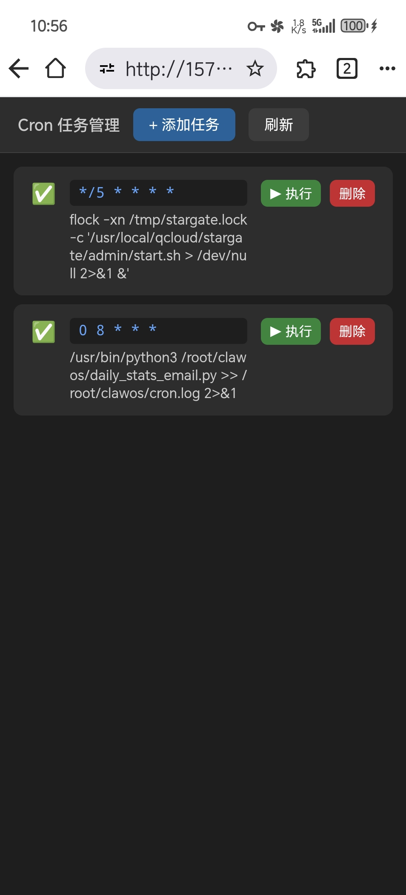
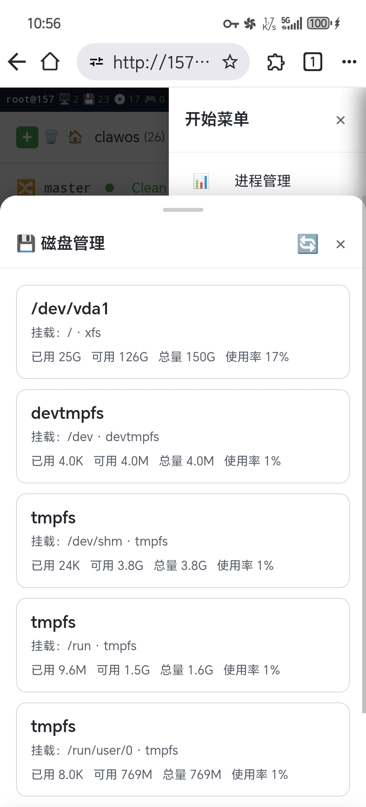
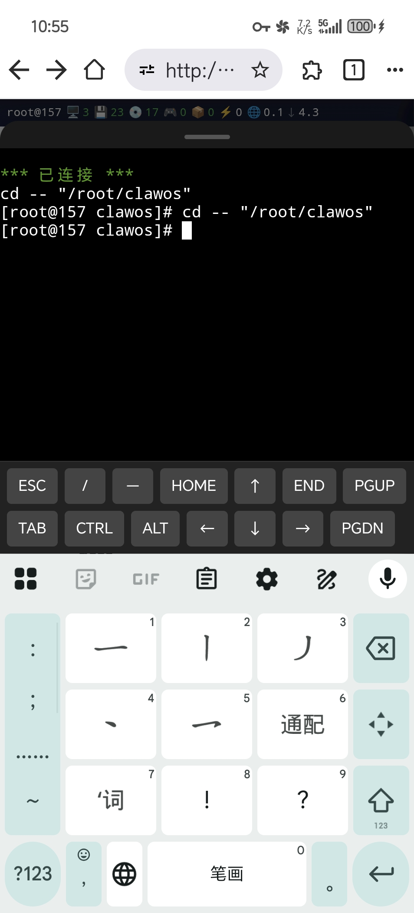
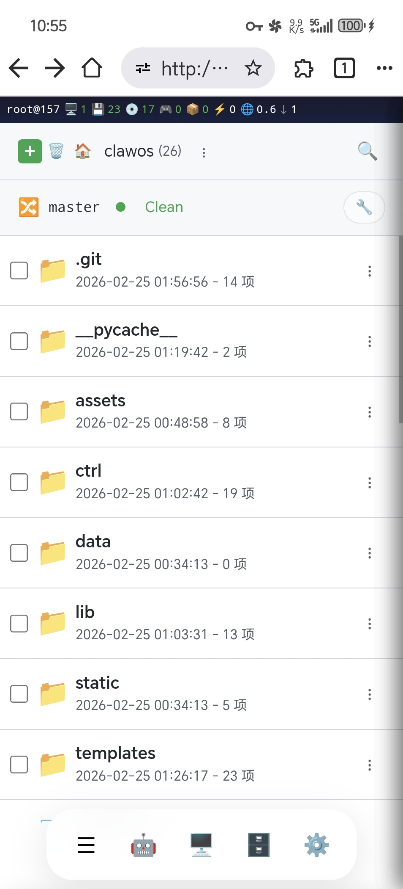

# 🖥️ ClawOS

A web-based management console for Linux systems with file management, system monitoring, and service administration capabilities.


---

## Screenshots

Click to view full size.

| | | |
|---|---|---|
|  |  |  |
|  |  |  |
|  |  |  |

---

## Table of Contents

- [Architecture](#architecture)
- [Features](#features)
- [Installation](#installation)
- [Configuration](#configuration)
- [API Reference](#api-reference)
- [Project Structure](#project-structure)
- [Security](#security)
- [License](#license)

---

## Architecture

```
┌─────────────────────────────────────────────────────────────────┐
│                         ClawOS Architecture                      │
├─────────────────────────────────────────────────────────────────┤
│                                                                 │
│  ┌──────────────────────────────────────────────────────────┐   │
│  │                    Web Browser (Client)                  │   │
│  │   ┌─────────────┐  ┌─────────────┐  ┌─────────────┐   │   │
│  │   │ File Browser│  │  Terminal   │  │   System    │   │   │
│  │   │     UI      │  │      UI     │  │   Monitor   │   │   │
│  │   └─────────────┘  └─────────────┘  └─────────────┘   │   │
│  └──────────────────────────────────────────────────────────┘   │
│                              │                                 │
│                    HTTP / WebSocket (REST API)                   │
│                              │                                 │
│  ┌──────────────────────────────────────────────────────────┐   │
│  │                    Flask Server                           │   │
│  │   ┌─────────────┐  ┌─────────────┐  ┌─────────────┐   │   │
│  │   │  Blueprints │  │  SocketIO   │  │   Auth     │   │   │
│  │   │  (REST API) │  │  (Terminal) │  │  Middleware │   │   │
│  │   └─────────────┘  └─────────────┘  └─────────────┘   │   │
│  └──────────────────────────────────────────────────────────┘   │
│                              │                                 │
│  ┌──────────────────────────────────────────────────────────┐   │
│  │                    Service Controllers                     │   │
│  │   ┌────────┐ ┌────────┐ ┌────────┐ ┌────────┐       │   │
│  │   │  File   │ │ System │ │  Git   │ │Docker │       │   │
│  │   │ Manager │ │ Monitor│ │Manager │ │Manager│       │   │
│  │   └────────┘ └────────┘ └────────┘ └────────┘       │   │
│  │   ┌────────┐ ┌────────┐ ┌────────┐ ┌────────┐       │   │
│  │   │ FRPMgr  │ │ClashMgr│ │OpenClaw│ │Terminal │       │   │
│  │   └────────┘ └────────┘ └────────┘ └────────┘       │   │
│  └──────────────────────────────────────────────────────────┘   │
│                              │                                 │
│              ┌───────────────┼───────────────┐                │
│              ▼               ▼               ▼                │
│      ┌───────────┐  ┌───────────┐  ┌───────────┐        │
│      │ Local File │ │Systemd    │ │ External   │        │
│      │   System   │ │ Services  │ │ Services   │        │
│      └───────────┘  └───────────┘  └───────────┘        │
│                                                                 │
└─────────────────────────────────────────────────────────────────┘
```

### Technology Stack

```
┌─────────────────────────────────────────┐
│              Frontend                    │
├─────────────────────────────────────────┤
│  HTML5 + CSS3 (Responsive)               │
│  Vue.js 3 (Reactive UI)                 │
│  xterm.js (Terminal Emulator)            │
│  Monaco Editor (Code Editing)            │
│  Socket.IO Client (WebSocket)            │
└─────────────────────────────────────────┘
                    │
                    ▼
┌─────────────────────────────────────────┐
│              Backend                     │
├─────────────────────────────────────────┤
│  Python 3.8+                            │
│  Flask 2.x (REST API)                  │
│  Flask-SocketIO 5.x (WebSocket)        │
│  psutil (System Monitoring)             │
│  GitPython (Git Integration)             │
└─────────────────────────────────────────┘
```

---

## Features

### 📂 File Management
- Browse files with hierarchical navigation
- Upload/download files (drag & drop supported)
- Create folders, rename, move, delete, clone
- Multi-select with checkboxes
- Batch operations (copy/move/delete)
- Trash recovery system
- File search with filters
- Symlink detection and handling
- Broken symlink visualization (black background, red text)

### 📝 Multi-Format Editors
- **JSON Editor**: Syntax highlighting, validation, tree/text/table modes
- **YAML/TOML Editor**: Monaco-based code editor with syntax highlighting
- **Markdown Preview**: Live preview with rendering
- **Code Editor**: Multi-language support (Python, JS, HTML, CSS, etc.)
- **Config Editors**: INI, CONF, XML support

### 🖥️ Web Terminal
- Full xterm.js terminal emulator
- Socket.IO-based real-time communication
- Command history navigation
- Session persistence

### 📊 System Monitoring
- CPU usage and memory statistics
- Process list with sorting
- Disk usage information
- Network interface stats
- GPU information (NVIDIA)
- Docker container management
- Systemd service management

### 🤖 Service Management

#### FRP Management (frpc)
```
┌─────────────────────────────────────┐
│  🌐 FRP 内网穿透                      │
├─────────────────────────────────────┤
│  Service Status: ● Running          │
│                                     │
│  Server: your-frp-server:17777      │
│                                     │
│  Proxies:                           │
│  - test-tcp (22 → 6022)           │
│  - http (80 → 6080)                │
│  - 18789 (18789 → 18789)           │
│  - 5001 (5001 → 15001)             │
│  - 6002 (6002 → 6002)              │
│                                     │
│  [Start] [Stop] [Restart]           │
│  [Edit Config]                      │
└─────────────────────────────────────┘
```

#### Clash Management
```
┌─────────────────────────────────────┐
│  🌐 Clash 代理                        │
├─────────────────────────────────────┤
│  Service Status: ● Running          │
│                                     │
│  Ports: 7890 (Mixed)                 │
│                                     │
│  📡 Subscription                    │
│  [输入订阅URL] [Update]             │
│                                     │
│  🎯 Proxy Groups                     │
│  - 一元机场 → 香港 01               │
│  - 自动选择 → 香港 02               │
│                                     │
│  📡 Nodes: 12                       │
│  📊 Rules: 514                      │
└─────────────────────────────────────┘
```

#### OpenClaw Integration
- Gateway status monitoring
- Agent management
- Channel configuration
- Skills installation tracking
- Health diagnostics

### 🐙 Git Integration
- Repository browser
- Branch management
- Commit history viewer
- Diff visualization
- Status bar integration

### 🔐 Security Features
- Password-based authentication
- Session management
- Path traversal protection
- File operation permissions
- Symlink safety checks

---

## Installation

### Prerequisites

```bash
# Python 3.8+
python --version  # Must be 3.8 or higher

# Node.js (optional, for frontend tests)
node --version
```

### 1. Install Dependencies

```bash
# Clone the repository
git clone https://github.com/mrytsr/clawos.git
cd clawos

# Install Python dependencies
pip install -r requirements.txt
```

### 2. Install CLI & Generate Password

```bash
# Run installation script (generates random password)
bash install.sh
```

This will:
- Create data directory at `~/.local/clawos`
- Generate random password to `~/.local/clawos/clawos_password.json`
- Install CLI to `/usr/local/bin/clawos`
- Install systemd user service

### 3. Start Service

```bash
# Using CLI
clawos start      # Start service
clawos stop       # Stop service
clawos restart    # Restart service
clawos status     # Show status & password
clawos log        # journalctl --user -u clawos -f View logs
clawos password   # Show password

# Or using systemd
systemctl --user start clawos
systemctl --user stop clawos
systemctl --user status clawos
systemctl --user enable clawos  # Enable on boot
```

### 4. Access the Interface

```
http://127.0.0.1:6002/
```

Login password is shown in `clawos status` or stored in `~/.local/clawos/clawos_password.json`

---

## API Reference

### File Operations

| Endpoint | Method | Description |
|----------|--------|-------------|
| `/api/file/list` | GET | List directory contents |
| `/api/file/info` | GET | Get file/directory info |
| `/api/file/read` | GET | Read file content |
| `/api/file/save` | POST | Write file content |
| `/api/file/create` | POST | Create file/folder |
| `/api/file/move` | POST | Move/rename file |
| `/api/file/delete` | POST | Delete file |
| `/api/file/copy` | POST | Copy file |
| `/api/trash/list` | GET | List trash contents |
| `/api/trash/restore` | POST | Restore from trash |

### System Operations

| Endpoint | Method | Description |
|----------|--------|-------------|
| `/api/process/list` | GET | List running processes |
| `/api/disk/list` | GET | List disk usage |
| `/api/network/list` | GET | List network interfaces |
| `/api/gpu/info` | GET | GPU information |
| `/api/system/exec` | POST | Execute system command |

### Service Management

| Endpoint | Method | Description |
|----------|--------|-------------|
| `/api/systemd/list` | GET | List systemd services |
| `/api/systemd/control` | POST | Control service (start/stop/restart) |
| `/api/docker/containers` | GET | List Docker containers |
| `/api/docker/container/start` | POST | Start container |
| `/api/docker/container/stop` | POST | Stop container |

### FRP Management

| Endpoint | Method | Description |
|----------|--------|-------------|
| `/api/frp/config` | GET | Get FRP configuration |
| `/api/frp/config` | POST | Save FRP configuration |

### Clash Management

| Endpoint | Method | Description |
|----------|--------|-------------|
| `/api/clash/state` | GET | Get Clash status |
| `/api/clash/proxies` | GET | Get proxy list |
| `/api/clash/subscribe` | POST | Update subscription |
| `/api/clash/switch` | POST | Switch proxy node |

### Git Operations

| Endpoint | Method | Description |
|----------|--------|-------------|
| `/api/git/repos` | GET | List git repositories |
| `/api/git/status` | GET | Get repository status |
| `/api/git/log` | GET | Get commit history |
| `/api/git/diff` | GET | Get diff output |

---

## Project Structure

```
clawos/
├── app.py                    # Flask application entry point
├── config.py                 # Configuration settings
├── requirements.txt          # Python dependencies
├── package.json             # Node.js dependencies
│
├── ctrl/                    # Flask blueprints (controllers)
│   ├── api_ctrl.py         # Generic API utilities
│   ├── auth_ctrl.py        # Authentication
│   ├── batch_ctrl.py       # Batch operations
│   ├── browser_ctrl.py     # File browser API
│   ├── clash_ctrl.py      # Clash proxy management
│   ├── edit_ctrl.py       # File editing
│   ├── file_ctrl.py       # File operations
│   ├── frp_ctrl.py        # FRP management
│   ├── git_ctrl.py        # Git integration
│   ├── openclaw_ctrl.py   # OpenClaw integration
│   ├── system_ctrl.py     # System monitoring
│   ├── task_ctrl.py       # Task management
│   └── term.py            # Terminal socket handler
│
├── lib/                     # Utility modules
│   ├── ai_client.py       # AI assistant client
│   ├── disk_utils.py      # Disk utilities
│   ├── docker_utils.py    # Docker utilities
│   ├── email_utils.py     # Email utilities
│   ├── file_utils.py      # File utilities
│   ├── git_utils.py       # Git utilities
│   ├── json_utils.py      # JSON utilities
│   ├── network_utils.py   # Network utilities
│   ├── packages_utils.py  # Package management
│   ├── path_utils.py      # Path utilities
│   ├── process_utils.py   # Process utilities
│   └── systemd_utils.py  # Systemd utilities
│
├── static/                  # Static assets
│   ├── js/
│   │   ├── bot.js         # AI assistant
│   │   ├── file_browser.js # File browser
│   │   ├── file_clipboard.js # Clipboard operations
│   │   ├── globals.js      # Global utilities
│   │   ├── git.js         # Git integration
│   │   ├── preview.js     # File preview
│   │   ├── system_monitor.js # System monitoring
│   │   ├── task_actions.js # Task actions
│   │   ├── task_poller.js # Task polling
│   │   └── terminal.js    # Terminal
│   └── css/                # Stylesheets
│
├── templates/              # HTML templates
│   ├── index.html         # Main application
│   ├── login.html         # Login page
│   ├── trash.html         # Trash management
│   ├── json_editor.html   # JSON editor
│   ├── yaml_editor.html   # YAML/TOML editor
│   ├── markdown.html      # Markdown preview
│   ├── code_editor.html   # Code editor
│   ├── git_commit.html    # Git commit viewer
│   └── ...
│
├── data/                   # Runtime data
│   ├── conversations.json # Chat history
│   └── trash/             # Trash directory
│
└── README.md              # This file
```

---

## Security

⚠️ **Important Security Notes**

1. **Default Credentials**: Change the default password immediately after installation
2. **Network Exposure**: Do not expose directly to the internet
3. **Use HTTPS**: Deploy behind a reverse proxy with HTTPS
4. **Terminal Access**: Web terminal can execute arbitrary commands - use carefully
5. **File Operations**: All file operations are logged

### Recommended Deployment

```
                    ┌─────────────────┐
                    │   Nginx/Caddy   │
                    │  (HTTPS + Auth) │
                    └────────┬────────┘
                             │
                    ┌────────▼────────┐
                    │  ClawOS (LAN)   │
                    │  http://:6002   │
                    └─────────────────┘
```

---

## License

MIT License - See LICENSE file for details.

---

# 🖥️ ClawOS

基于 Web 的 Linux 系统管理控制台，提供文件管理、系统监控和服务管理功能。

## 架构─────────────────────────────────────────────────────────────────┐

```
┌
│                       ClawOS 架构                               │
├─────────────────────────────────────────────────────────────────┤
│                                                                 │
│  ┌──────────────────────────────────────────────────────────┐   │
│  │                    浏览器客户端                          │   │
│  │   ┌─────────────┐  ┌─────────────┐  ┌─────────────┐   │   │
│  │   │  文件管理   │  │   终端     │  │  系统监控   │   │   │
│  │   └─────────────┘  └─────────────┘  └─────────────┘   │   │
│  └──────────────────────────────────────────────────────────┘   │
│                              │                                 │
│                    HTTP / WebSocket (REST API)                 │
│                              │                                 │
│  ┌──────────────────────────────────────────────────────────┐   │
│  │                    Flask 服务器                           │   │
│  │   ┌─────────────┐  ┌─────────────┐  ┌─────────────┐   │   │
│  │   │  Blueprints │  │  SocketIO  │  │   认证     │   │   │
│  │   └─────────────┘  └─────────────┘  └─────────────┘   │   │
│  └──────────────────────────────────────────────────────────┘   │
│                              │                                 │
│  ┌──────────────────────────────────────────────────────────┐   │
│  │                    服务控制器                             │   │
│  │   ┌────────┐ ┌────────┐ ┌────────┐ ┌────────┐         │   │
│  │   │  文件   │ │ 系统   │ │  Git   │ │Docker │         │   │
│  │   │  管理  │ │ 监控  │ │ 管理   │ │ 管理  │         │   │
│  │   └────────┘ └────────┘ └────────┘ └────────┘         │   │
│  │   ┌────────┐ ┌────────┐ ┌────────┐ ┌────────┐         │   │
│  │   │ FRP管理│ │Clash管理│ │OpenClaw│ │ 终端  │         │   │
│  │   └────────┘ └────────┘ └────────┘ └────────┘         │   │
│  └──────────────────────────────────────────────────────────┘   │
│                              │                                 │
│              ┌───────────────┼───────────────┐                │
│              ▼               ▼               ▼                │
│      ┌───────────┐  ┌───────────┐  ┌───────────┐        │
│      │ 本地文件系统 │ │ Systemd  │ │ 外部服务  │        │
│      └───────────┘  └───────────┘  └───────────┘        │
│                                                                 │
└─────────────────────────────────────────────────────────────────┘
```

## 功能特性

### 📂 文件管理
- 分层导航浏览文件
- 上传/下载文件（支持拖拽）
- 创建文件夹、重命名、移动、删除、克隆
- 多选操作
- 批量操作（复制/移动/删除）
- 回收站恢复系统
- 文件搜索和过滤
- 软链接检测和处理
- 破损软链接可视化（黑底红字）

### 📝 多格式编辑器
- **JSON 编辑器**: 语法高亮、验证、树/文本/表格模式
- **YAML/TOML 编辑器**: Monaco 代码编辑器
- **Markdown 预览**: 实时预览渲染
- **代码编辑器**: 多语言支持
- **配置文件编辑**: INI、CONF、XML 支持

### 🖥️ Web 终端
- 完整的 xterm.js 终端模拟器
- Socket.IO 实时通信
- 命令历史导航
- 会话持久化

### 📊 系统监控
- CPU 使用率和内存统计
- 进程列表（支持排序）
- 磁盘使用信息
- 网络接口统计
- GPU 信息（NVIDIA）
- Docker 容器管理
- Systemd 服务管理

### 🤖 服务管理

#### FRP 管理
```
┌─────────────────────────────────────┐
│  🌐 FRP 内网穿透                      │
├─────────────────────────────────────┤
│  服务状态: ● 运行中                  │
│                                     │
│  服务端: your-frp-server:17777      │
│                                     │
│  代理列表:                           │
│  - test-tcp (22 → 6022)            │
│  - http (80 → 6080)                 │
│  - 18789 (18789 → 18789)            │
│  - 5001 (5001 → 15001)              │
│  - 6002 (6002 → 6002)               │
│                                     │
│  [启动] [停止] [重启]                │
│  [编辑配置]                          │
└─────────────────────────────────────┘
```

#### Clash 管理
```
┌─────────────────────────────────────┐
│  🌐 Clash 代理                        │
├─────────────────────────────────────┤
│  服务状态: ● 运行中                  │
│                                     │
│  端口: 7890 (混合端口)               │
│                                     │
│  📡 订阅管理                          │
│  [输入订阅URL] [更新]               │
│                                     │
│  🎯 代理组                           │
│  - 一元机场 → 香港 01               │
│  - 自动选择 → 香港 02               │
│                                     │
│  📡 节点: 12 个                      │
│  📊 规则: 514 条                     │
└─────────────────────────────────────┘
```

#### OpenClaw 集成
- Gateway 状态监控
- Agent 管理
- 频道配置
- Skills 安装跟踪
- 健康诊断

### 🐙 Git 集成
- 仓库浏览器
- 分支管理
- 提交历史查看
- Diff 可视化
- 状态栏集成

### 🔐 安全特性
- 密码认证
- 会话管理
- 路径遍历保护
- 文件操作权限
- 软链接安全检查

## 安装

### 环境要求

```bash
# Python 3.8+
python --version  # 必须 3.8 或更高版本

# Node.js (可选，用于前端测试)
node --version
```

### 1. 安装依赖

```bash
# 克隆仓库
git clone https://github.com/mrytsr/clawos.git
cd clawos

# 安装 Python 依赖
pip install -r requirements.txt
```

### 2. 安装 CLI 并生成密码

```bash
# 运行安装脚本（生成随机密码）
bash install.sh
```

安装过程会：
- 在 `~/.local/clawos` 创建数据目录
- 生成随机密码到 `~/.local/clawos/clawos_password.json`
- 安装 CLI 到 `/usr/local/bin/clawos`
- 安装 systemd 用户服务

### 3. 启动服务

```bash
# 使用 CLI
clawos start      # 启动服务
clawos stop       # 停止服务
clawos restart    # 重启服务
clawos status     # 查看状态和密码
clawos log        # journalctl --user -u clawos -f 查看日志
clawos password   # 查看密码

# 或使用 systemd
systemctl --user start clawos
systemctl --user stop clawos
systemctl --user status clawos
systemctl --user enable clawos  # 开机自启
```

### 4. 访问界面

```
http://127.0.0.1:6002/
```

登录密码在 `clawos status` 中查看，或查看 `~/.local/clawos/clawos_password.json`

## API 参考

### 文件操作

| 端点 | 方法 | 描述 |
|------|------|------|
| `/api/file/list` | GET | 列出目录内容 |
| `/api/file/info` | GET | 获取文件/目录信息 |
| `/api/file/read` | GET | 读取文件内容 |
| `/api/file/save` | POST | 写入文件内容 |
| `/api/file/create` | POST | 创建文件/文件夹 |
| `/api/file/move` | POST | 移动/重命名 |
| `/api/file/delete` | POST | 删除文件 |
| `/api/file/copy` | POST | 复制文件 |
| `/api/trash/list` | GET | 列出回收站内容 |
| `/api/trash/restore` | POST | 从回收站恢复 |

### 系统操作

| 端点 | 方法 | 描述 |
|------|------|------|
| `/api/process/list` | GET | 列出运行进程 |
| `/api/disk/list` | GET | 列出磁盘使用情况 |
| `/api/network/list` | GET | 列出网络接口 |
| `/api/gpu/info` | GET | GPU 信息 |
| `/api/system/exec` | POST | 执行系统命令 |

### 服务管理

| 端点 | 方法 | 描述 |
|------|------|------|
| `/api/systemd/list` | GET | 列出 systemd 服务 |
| `/api/systemd/control` | POST | 控制服务 |
| `/api/docker/containers` | GET | 列出 Docker 容器 |
| `/api/docker/container/start` | POST | 启动容器 |
| `/api/docker/container/stop` | POST | 停止容器 |

### FRP 管理

| 端点 | 方法 | 描述 |
|------|------|------|
| `/api/frp/config` | GET | 获取 FRP 配置 |
| `/api/frp/config` | POST | 保存 FRP 配置 |

### Clash 管理

| 端点 | 方法 | 描述 |
|------|------|------|
| `/api/clash/state` | GET | 获取 Clash 状态 |
| `/api/clash/proxies` | GET | 获取代理列表 |
| `/api/clash/subscribe` | POST | 更新订阅 |
| `/api/clash/switch` | POST | 切换代理节点 |

### Git 操作

| 端点 | 方法 | 描述 |
|------|------|------|
| `/api/git/repos` | GET | 列出 Git 仓库 |
| `/api/git/status` | GET | 获取仓库状态 |
| `/api/git/log` | GET | 获取提交历史 |
| `/api/git/diff` | GET | 获取差异输出 |

## 项目结构

```
clawos/
├── app.py                    # Flask 应用入口
├── config.py                 # 配置设置
├── requirements.txt          # Python 依赖
├── package.json             # Node.js 依赖
│
├── ctrl/                    # Flask 蓝图（控制器）
│   ├── api_ctrl.py         # 通用 API 工具
│   ├── auth_ctrl.py        # 认证
│   ├── batch_ctrl.py       # 批量操作
│   ├── browser_ctrl.py     # 文件浏览器 API
│   ├── clash_ctrl.py      # Clash 代理管理
│   ├── edit_ctrl.py       # 文件编辑
│   ├── file_ctrl.py       # 文件操作
│   ├── frp_ctrl.py        # FRP 管理
│   ├── git_ctrl.py        # Git 集成
│   ├── openclaw_ctrl.py   # OpenClaw 集成
│   ├── system_ctrl.py     # 系统监控
│   ├── task_ctrl.py       # 任务管理
│   └── term.py            # 终端 Socket 处理器
│
├── lib/                     # 工具模块
│   ├── ai_client.py       # AI 助手客户端
│   ├── disk_utils.py      # 磁盘工具
│   ├── docker_utils.py    # Docker 工具
│   ├── email_utils.py     # 邮件工具
│   ├── file_utils.py      # 文件工具
│   ├── git_utils.py       # Git 工具
│   ├── json_utils.py      # JSON 工具
│   ├── network_utils.py   # 网络工具
│   ├── packages_utils.py  # 包管理工具
│   ├── path_utils.py      # 路径工具
│   ├── process_utils.py   # 进程工具
│   └── systemd_utils.py   # Systemd 工具
│
├── static/                  # 静态资源
│   ├── js/
│   │   ├── bot.js         # AI 助手
│   │   ├── file_browser.js # 文件浏览器
│   │   ├── file_clipboard.js # 剪贴板操作
│   │   ├── globals.js      # 全局工具
│   │   ├── git.js         # Git 集成
│   │   ├── preview.js     # 文件预览
│   │   ├── system_monitor.js # 系统监控
│   │   ├── task_actions.js # 任务操作
│   │   ├── task_poller.js # 任务轮询
│   │   └── terminal.js    # 终端
│   └── css/                # 样式表
│
├── templates/              # HTML 模板
│   ├── index.html         # 主应用
│   ├── login.html         # 登录页面
│   ├── trash.html         # 回收站管理
│   ├── json_editor.html   # JSON 编辑器
│   ├── yaml_editor.html   # YAML/TOML 编辑器
│   ├── markdown.html      # Markdown 预览
│   ├── code_editor.html   # 代码编辑器
│   ├── git_commit.html    # Git 提交查看
│   └── ...
│
├── data/                   # 运行时数据
│   ├── conversations.json # 聊天历史
│   └── trash/             # 回收站目录
│
└── README.md              # 本文件
```

## 安全

⚠️ **重要安全提示**

1. **默认凭据**: 安装后请立即修改默认密码
2. **网络暴露**: 不要直接暴露到公网
3. **使用 HTTPS**: 在反向代理后部署并启用 HTTPS
4. **终端访问**: Web 终端可执行任意命令，请谨慎授权
5. **文件操作**: 所有文件操作都有日志记录

### 推荐的部署方式

```
                    ┌─────────────────┐
                    │   Nginx/Caddy   │
                    │  (HTTPS + 认证) │
                    └────────┬────────┘
                             │
                    ┌────────▼────────┐
                    │  ClawOS (内网)   │
                    │  http://:6002   │
                    └─────────────────┘
```

## 许可证

MIT License - 详见 LICENSE 文件。
